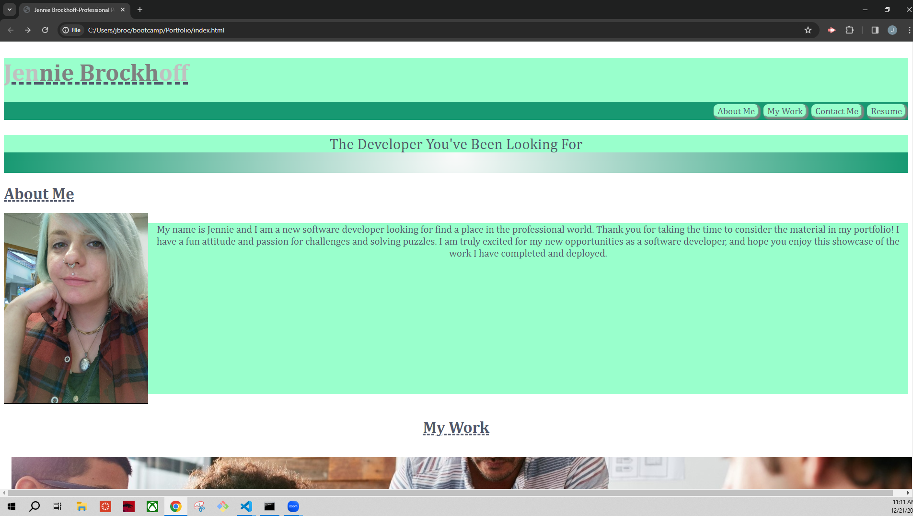

 # <Portfolio>

## Description

I have created this webpage in order to highlight my skills as a software developer and to make my professional work and resume easily accessible to potential employers. I wanted to build a webpage from scratch and make it unique in order to stand out as an exceptional candidate for software development. Thiss will be an asset while applying for positions as developer and help me deepen my knowledge of the process involved in creating a deployed application

## Installation

N/A

## Usage

This page is used as a professional portfolio for employment opportunities.

Here is a screenshot of the completed webpage:

[Here is a link to the deployed application]()

## Credits

Images sourced from http://Shutterstock.com

Tutorials for HTML and CSS obtained from http://w3schools.com
and https://www.youtube.com/@NetNinja

## License

MIT License

Copyright (c) [2023] [Jennie Brockhoff]

Permission is hereby granted, free of charge, to any person obtaining a copy
of this software and associated documentation files (the "Software"), to deal
in the Software without restriction, including without limitation the rights
to use, copy, modify, merge, publish, distribute, sublicense, and/or sell
copies of the Software, and to permit persons to whom the Software is
furnished to do so, subject to the following conditions:

The above copyright notice and this permission notice shall be included in all
copies or substantial portions of the Software.

THE SOFTWARE IS PROVIDED "AS IS", WITHOUT WARRANTY OF ANY KIND, EXPRESS OR
IMPLIED, INCLUDING BUT NOT LIMITED TO THE WARRANTIES OF MERCHANTABILITY,
FITNESS FOR A PARTICULAR PURPOSE AND NONINFRINGEMENT. IN NO EVENT SHALL THE
AUTHORS OR COPYRIGHT HOLDERS BE LIABLE FOR ANY CLAIM, DAMAGES OR OTHER
LIABILITY, WHETHER IN AN ACTION OF CONTRACT, TORT OR OTHERWISE, ARISING FROM,
OUT OF OR IN CONNECTION WITH THE SOFTWARE OR THE USE OR OTHER DEALINGS IN THE
SOFTWARE.

---